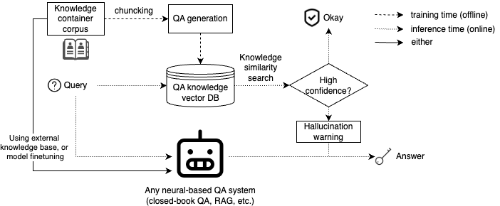

# HalluPAQ

`HalluPAQ` is a systematic toolkit for efficient confidence scoring and hallucination detection in domain-specific Large Language Models (LLMs). This toolkit is designed to assess the credibility of LLM outputs by utilizing a vector database to index and query a corpus of Probable Asked Questions (PAQ), efficiently determining the veracity of LLM responses by measuring their similarity to known knowledge. Our method not only provides rapid evaluations but also significantly outperforms existing methods in ROC-AUC scores, establishing a new standard for safe LLM deployment.

[]()

## Table of Contents

- [Introduction](#introduction)
  - [HalluPAQ System Overview](#hallupaq-system-overview)
  - [Data](#data)
- [Installation](#installation)
- [Usage](#usage)
- [Methodology](#methodology)
- [Results](#results)

## Introduction

### HalluPAQ System Overview



### Data

**Training Set**: Ground truth texts from [StatPearls and Anatomy Gray](https://huggingface.co/MedRAG), processed by OpenAI models to generate questions and answers.

**Validation Set & Test Set**:
- **Paraphrased Questions**: From the training set for adaptability testing.
- **Out-of-Coverage Questions**: Challenge the model with diverse biomedical topics from PubMed not present in the training data.

| Dataset Split | Description                            |
|---------------|----------------------------------------|
| **Train**     | - 32,813 QA pairs on biomedical studies (StatPerls and Anatomy Gray) <br> - Generated by OpenAI models |
| **Validation**| - 3,820 QA pairs <br> - 1,497 questions paraphrased from train <br> - 2,323 out-of-coverage questions |
| **Test**      | - 3,819 QA pairs <br> - 1,503 questions paraphrased from train <br> - 2,316 out-of-coverage questions |

Ground-truth tagging rules

| Split        | Prompt category | Tag  |
|--------------|-----------------|------|
| **In-coverage** | Answers match   | False|
|              | Not match       | True |
| **PubMed**   | Answers match   | False|
|              | "Don't know"    | True |
|              | Not match       | True |
| **Surreal**  | Tricked         | True |
|              | Not tricked     | False|
## Installation

Clone the repository and install dependencies:
```bash
git clone https://github.com/orangejustin/HalluPAQ.git
cd HalluPAQ
pip install -r requirements.txt
```

## Usage

1. To generate group Q&A pairs, follow these steps:
   1. Modify the input corpus and output directory settings as needed.
   2. Run the Q&A generation script:
```bash
python3 qa_generation/qa_generation.py
```
We obtain the generated Q&A pairs in the `knowledge_souce` directory.

```python
import HalluPAQ

```

## Methodology

`HalluPAQ` employs a novel approach to enhance the reliability of LLM outputs through efficient indexing and querying of a PAQ corpus. This methodology ensures rapid evaluations and high accuracy in determining the credibility of LLM responses.

## Results

`HalluPAQ` achieves an average ROC-AUC score of **0.76952** and an average overhead time of **0.00455 seconds**, outperforming existing methods such as SelfCheckGPT-NLI and FactScore.

| Method            | Average ROC-AUC Score | Average Overhead Time (s) |
|-------------------|-----------------------|---------------------------|
| SelfCheckGPT-NLI  | 0.71644               | 8.40976                   |
| SelfCheckGPT-LLM  | 0.65269               | 9.32812                   |
| FactScore         | 0.76484               | 5.90891                   |
| **HalluPAQ**      | **0.76952**           | **0.00455**               |


